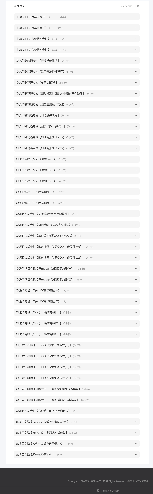

# 课程安排

**课程目录**

**课程安排**

每天看课(1.5h 复习半小时)(2h)

1.454min 8h

2.399min 7h

3.144min 2.5h

4.75min  1.5h

5.336min  6h

6.504min 8.5h

7.244min 4.5h

8.617min 10.5h

9.173min 3h

10. 555min 9.5h
11. 294min 5h
12. 195min 3.5h
13. 166min 3h
14. 291min 5h
15. 383min 6.5h
16. 138min 2.5h
17. 152min 3h
18. 136min 2.5h
19. 339min 6.0h
20. 472min 8h
21. 330min 6h
22. 621min 10.5h
23. 611min 10.5h
24. 262min 4.5h
25. 232min 4h
26. 249min 4.5h
27. 117min 2h
28. 262min 4.5h
29. 171min 3h
30. 186min 3.5h
31. 343min 6h
32. 183min 3.5h
33. 254min 4.5h